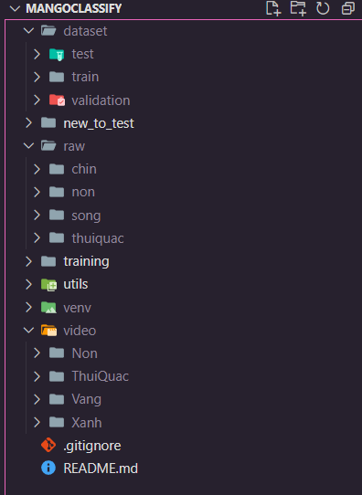

## FOLDER STRUCTURE:



## Run cell by cell this program: [Train](./training/train.ipynb)

# You should create venv for your project and install the following package:

- scikit-learn
- tensorflow
- keras
- matplotlib
- seaborn
- pandas
- numpy

or using this command:

```bash
pip install scikit-learn tensorflow keras matplotlib seaborn pandas numpy
```

`There are some others package you have to install while runnning the experiment. You should read the log or error from your terminal or jupyter notebook output to checking for missing packages.`

## datasets: [Link to dataset](https://drive.google.com/drive/folders/1tjwnl7I6nLZbgV5f4Er1k9-H4ua6qzjK?usp=sharing)

Video is a raw folder which contain unprocessed video. You should run [extractImgFromVideo](./utils/extractImgFromVideo.py) to extract image from raw video. You can change frame skip as you wish.

After extract images from videos. You should have raw folder contain images from every class in this project. You should use [split_data](./utils/split_data.py) to split the dataset into train, test and validation set.
After that you can run the experiment.
`Some of the function may not work correctly that force you have to create folder yourself, if you're encouted any error when running those two utils file, you should create folder by yourself.`
