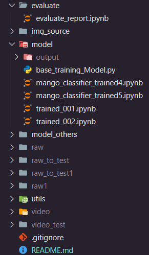

## FOLDER STRUCTURE:



## Run cell by cell one of these model : [model](./model/)

# You should create venv for your project and install the following package:

- scikit-learn
- tensorflow
- keras
- matplotlib
- seaborn
- pandas
- numpy

or using this command:

```bash
pip install scikit-learn tensorflow keras matplotlib seaborn pandas numpy
```

`There are some others package you have to install while runnning the experiment. You should read the log or error from your terminal or jupyter notebook output to checking for missing packages.`

## datasets: [Link to train set](https://drive.google.com/file/d/1vsbHGtdePzGWAtO-A06kCmxhszG8TPT2/view), [Link to test set](https://drive.google.com/file/d/178lJFzFRqS9olO1sE0bLTFBI_h89DnuW/view)

The Video folder contains unprocessed videos. You should run the [extractImgFromVideo](./utils/extractImgFromVideo.py) script to extract images from the raw videos into the dataset folder. You can adjust the frame skip as needed. There are two datasets: one for training and the other for testing. You should extract images for both video folders.

`After that, you can run the experiment. Note that some functions may not work correctly, which may require you to create folders manually. If you encounter any errors while running the two utility files, you should create the folders yourself.`
